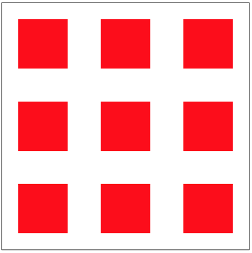

# 2019-01-14学习计划

## 继续学习**HTML5**和**CSS3**的基础知识

## 了解常见CSS布局方式 （Flex FLoat Grid）

  * FLex 现在较为流行的布局方式
  * Float 不流行 不推荐的方式 但偶尔偶尔可能会用到 也不难 需要会写
  * Grid 用的人不多 了解下就行了
  * 上述三种布局有什么差异 会造成什么效果

## 学习要点

  * Flex布局为主
  * CSS box-sizing属性
  * CSS display属性

## 今日作业

  * 完善task文件夹下的demo1中的`.container`类样式和`.item`样式，最终达到下图布局效果

  * 不可以设置container的height属性 但是最终效果要达到container的宽高均为500px

  * 